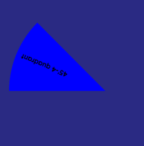

# Vue SpinningWheel
[Demo](https://gordianknotc.github.io/vue_spin_wheel)


## Drawing Sector
[source][sector]

__properties__:
- text
- background-color
- border-thickness
- sectorAngleInDegree - sector大小（度）
- initialQuadrant - 初始象限
- diameter - sector 直徑
- font-Color
### Examples
```vue
<template lang="pug">
Sector(
    text="45'-4 quadrant"
    background-color="blue"
    :border-thickness="0"
    :sectorAngleInDegree="45"
    :initialQuadrant="4"
    :diameter="280"
    font-color="black"
)
</template>
```



```vue
<template lang="pug">
Sector(
    text="60'-4 quadrant"
    background-color="orange"
    :border-thickness="0"
    :sectorAngleInDegree="60"
    :initialQuadrant="4"
    :diameter="280"
)
</template>
```


```vue
<template lang="pug">
Sector(
    text="45'-1 quadrant"
    background-color="blue"
    :border-thickness="0"
    :sectorAngleInDegree="45"
    :initialQuadrant="1"
    :diameter="280"
)
</template>
```


```vue
<template lang="pug">
Sector(
    text="60'-2 quadrant"
    background-color="orange"
    :border-thickness="0"
    :sectorAngleInDegree="60"
    :initialQuadrant="2"
    :diameter="280"
)
</template>
```


### Sector 組成

```vue
<template lang="pug">
section
  .container.relative(ref="sectorContainer")
    .sector(ref="sector")
      .sector__before
      .sector__content {{text}}
      .sector__after

</template>
```

|  container   | before  |  content |
|  ----        | ----    |  ----    |
|   |  |  |


## Drawing SpinningWheel

[vue-source][vue-spinwheel]


```vue
<template lang="pug">
      .wheel__content(ref="wheelElt")
        .wheel__innerShadow
        Sector.wheel__sector(
          v-for="(item, idx) in wheel?.state.dataList"
          :style="getSectorStyle(idx)"
          :key="idx"
          :text="item.worth"
          :background-color="getColor(item, idx)"
          :border-thickness="0"
          :diameter="280"
          :sectorAngleInDegree="wheel.sectorAngle"
          :initialQuadrant="4"
          :fontColor="getFontColor(item)"
          fontSize="1.5rem"
        )
</template>
```


依以上 Sector 組件實作 SpinWheel 邏輯

[ts-source][ts-spinwheel]
```ts
export class SpinWheel<T> {
  /** spin counter 計數，用來疊加 spin 度數，如第一次轉 1000 度，第二次 counter 疊加就變成 2000*/
  private _spinCounter: number = 1;
  /** 取 dart Completer 的概念，用來 complete spin 所返回的 Promise*/
  private _completer?: { resolve: any, reject: any };

  /** spin stage, SpinWheelStage.spinning | SpinWheelStage.idle*/
  get stage(): SpinWheelStage {
    return this.state.stage!;
  }

  /** sector 數量*/
  get sectorNumbers(): number {
    return this.state.dataList.length;
  }

  /** sector 大小(in degree)*/
  get sectorAngle(): number {
    return 360 / this.state.dataList.length;
  }

  constructor(
    public state: UnwrapNestedRefs<SpinWheelState<T>>,
    /** on transition animation start*/
    private _onTransitionStart: () => void = DEFAULT_CB,
    /** on transition animation end*/
    private _onTransitionEnd: () => void = DEFAULT_CB,
    /** default 30 */
    private speed: number = DEFAULT_SPEED,
  ) {
    this.state.targetDegree ??= 0;
    this.state.stage ??= SpinWheelStage.idle;
    const wheelElt: HTMLElement = this.state.element;

    wheelElt.ontransitionstart = () => {
      this.state.stage = SpinWheelStage.spinning;
      _onTransitionStart();
      console.log("start, set stage to", this.state.stage);
    };

    wheelElt.ontransitionend = () => {
      this.state.stage = SpinWheelStage.idle;
      this._spinCounter++;
      this._completer?.resolve(true);
      _onTransitionEnd();
      console.log("end, set stage to", this.state.stage);
    };
  }

  protected _spinTo(condition: (elt: T) => boolean) {
    const initialSpeed = 360 * this.speed * this._spinCounter;
    const targetIndex = (this.state.dataList as T[]).findIndex(condition);
    console.log("spin to index:", targetIndex);

    const targetDegree = this.sectorAngle * targetIndex - this.state.initialDegree;
    const shift = +this.sectorAngle / 2;
    this.state.targetDegree = -(initialSpeed + targetDegree + shift);
    console.log("set target degree to:", this.state.targetDegree);

    this.state.element.style.transform = `rotate(${this.state.targetDegree}deg)`;
  }

  async spin(condition: (elt: T) => boolean): Promise<boolean> {
    if (this.state.stage == SpinWheelStage.spinning)
      return Promise.resolve(false);

    const future = new Promise<boolean>((resolve, reject) => {
      this._completer = {resolve, reject};
    });
    this._spinTo(condition);
    return future;
  }
}
```

## Todo
- SpinWheel
    - [ ] 轉為跨平台組 ts 件
- Sector
    - [V] vue
    - [ ] react

[sector]: src/components/Sector.vue
[vue-spinwheel]: src/views/demos/SpinWheelDemo.vue
[ts-spinwheel]: src/components/SpinWheel.ts

